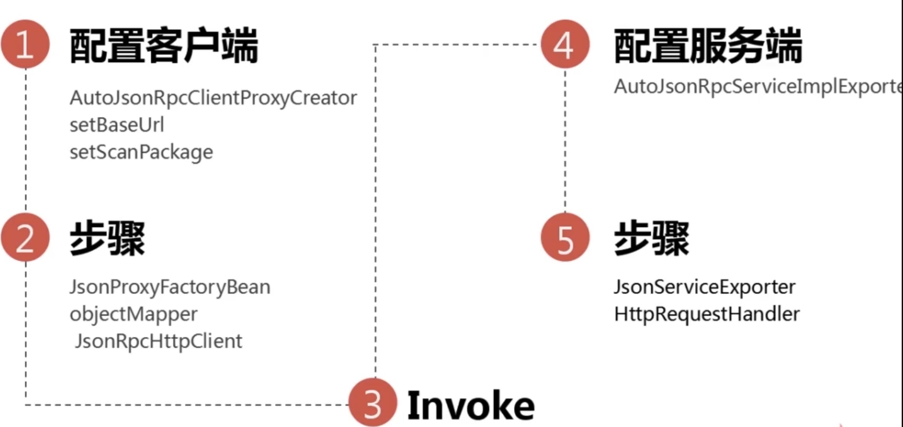
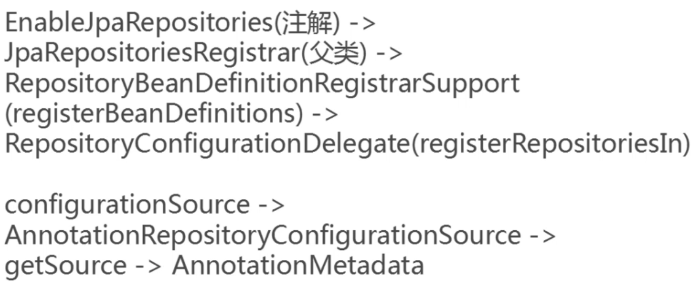

# Financial product system
Financial Products trading platform, backend data transformation and interactivity with outer products provider.
## Feature
1. Agile: development, iteration
+ Sale & Management
+ JUnit to test function
+ Swagger to write docs
+ Spring Boot
+ Spring Data JPA: multi data sources and read/write splitting
+ Automation test
2. Effective: high concurrency, fast response
+ Multi-node sale side: JSON-RPC
+ hazelcast cache
+ ActiveMQ
3. Security: Encryption, authority 
+ Tyk: HTTPS, RSA signature, access control, control speed, access statistics

Reconciliation 对账业务

## Modules

1. Util: utilities
2. Quartz: timed task
3. Swagger: interface management
4. Entity: entity classes
5. API: interface of management part and sale apart
6. Management: manage products
+ CRUD function implementation
+ Automation test
+ Swagger: Swagger is an open-source software framework backed by a large ecosystem of tools that helps developers design, build, document, and consume RESTful web services.
7. Sale: sell products
+ jsonRPC: service call each other
+ hazelcast: cache
+ activeMQ: maintain cache event to send massages about cache updates and cache expires
Apache ActiveMQ is an open source message broker written in Java together with a full Java Message Servic e client. 
+ Automation test
+ Tyk: Tyk is an open source `API Gateway` that is fast, scalable and modern. Out of the box, Tyk offers an API Management Platform with an API Gateway, API Analytics, Developer Portal and API Management Dashboard. 
+ quartz: timed task
## DB design
### Manager 
Product: 编号，名称，收益率，锁定期，状态，起投金额，投资步长，备注，创建时间，创建者，更新时间，更新者

### Seller
Order(订单)：订单编号，渠道编号，产品编号，用户编号，外部订单编号，类型，状态，金额，备注，创建时间，更新时间

#### INNODB vs MyISAM?
InnoDB 支持事务处理与外键和行级锁，MyISAM不支持
MyISAM manages nontransactional tables. It provides high-speed storage and retrieval, as well as fulltext searching capabilities. Each MyISAM table is stored on disk in three files. The files have names that begin with the table name and have an extension to indicate the file type. An .frm file stores the table format. The data file has an .MYD (MYData) extension. The index file has an .MYI (MYIndex) extension. Each MyISAM table is stored in a separate file, which could be compressed then with myisamchk if needed.

With InnoDB the tables are stored in tablespace and not much further optimization is possible. All data except for TEXT and BLOB can occupy 8,000 bytes at most. No full text indexing is available for InnoDB. The COUNT(*) execute slower than in MyISAM due to tablespace complexity. InnoDB is a transaction-safe (ACID compliant) storage engine for MySQL that has commit, rollback, and crash-recovery capabilities to protect user data.
MyISAM 和InnoDB 讲解
　　InnoDB和MyISAM是许多人在使用MySQL时最常用的两个表类型，这两个表类型各有优劣，视具体应用而定。基本的差别为：MyISAM类型不支持事务处理等高级处理，而InnoDB类型支持。MyISAM类型的表强调的是性能，其执行数度比InnoDB类型更快，但是不提供事务支持，而InnoDB提供事务支持以及外部键等高级数据库功能。

　　以下是一些细节和具体实现的差别：
　　◆1.InnoDB不支持FULLTEXT类型的索引。
　　◆2.InnoDB 中不保存表的具体行数，也就是说，执行select count(*) from table时，InnoDB要扫描一遍整个表来计算有多少行，但是MyISAM只要简单的读出保存好的行数即可。注意的是，当count(*)语句包含 where条件时，两种表的操作是一样的。
　　◆3.对于AUTO_INCREMENT类型的字段，InnoDB中必须包含只有该字段的索引，但是在MyISAM表中，可以和其他字段一起建立联合索引。
　　◆4.DELETE FROM table时，InnoDB不会重新建立表，而是一行一行的删除。
　　◆5.LOAD TABLE FROM MASTER操作对InnoDB是不起作用的，解决方法是首先把InnoDB表改成MyISAM表，导入数据后再改成InnoDB表，但是对于使用的额外的InnoDB特性(例如外键)的表不适用。
　　另外，InnoDB表的行锁也不是绝对的，假如在执行一个SQL语句时MySQL不能确定要扫描的范围，InnoDB表同样会锁全表，例如update table set num=1 where name like “%aaa%”
　　两种类型最主要的差别就是Innodb 支持事务处理与外键和行级锁。而MyISAM不支持.所以MyISAM往往就容易被人认为只适合在小项目中使用。
　　作为使用MySQL的用户角度出发，Innodb和MyISAM都是比较喜欢的，如果数据库平台要达到需求：99.9%的稳定性，方便的扩展性和高可用性来说的话，MyISAM绝对是首选。
　　原因如下：
　　1、平台上承载的大部分项目是读多写少的项目，而MyISAM的读性能是比Innodb强不少的。
　　2、MyISAM的索引和数据是分开的，并且索引是有压缩的，内存使用率就对应提高了不少。能加载更多索引，而Innodb是索引和数据是紧密捆绑的，没有使用压缩从而会造成Innodb比MyISAM体积庞大不小。
　　3、经常隔1，2个月就会发生应用开发人员不小心update一个表where写的范围不对，导致这个表没法正常用了，这个时候MyISAM的优越性就体现出来了，随便从当天拷贝的压缩包取出对应表的文件，随便放到一个数据库目录下，然后dump成sql再导回到主库，并把对应的binlog补上。如果是Innodb，恐怕不可能有这么快速度，别和我说让Innodb定期用导出xxx.sql机制备份，因为最小的一个数据库实例的数据量基本都是几十G大小。
　　4、从接触的应用逻辑来说，select count(*) 和order by 是最频繁的，大概能占了整个sql总语句的60%以上的操作，而这种操作Innodb其实也是会锁表的，很多人以为Innodb是行级锁，那个只是where对它主键是有效，非主键的都会锁全表的。
　　5、还有就是经常有很多应用部门需要我给他们定期某些表的数据，MyISAM的话很方便，只要发给他们对应那表的frm.MYD,MYI的文件，让他们自己在对应版本的数据库启动就行，而Innodb就需要导出xxx.sql了，因为光给别人文件，受字典数据文件的影响，对方是无法使用的。
　　6、如果和MyISAM比insert写操作的话，Innodb还达不到MyISAM的写性能，如果是针对基于索引的update操作，虽然MyISAM可能会逊色Innodb,但是那么高并发的写，从库能否追的上也是一个问题，还不如通过多实例分库分表架构来解决。
　　7、如果是用MyISAM的话，merge引擎可以大大加快应用部门的开发速度，他们只要对这个merge表做一些select count(*)操作，非常适合大项目总量约几亿的rows某一类型(如日志，调查统计)的业务表。
　　当然Innodb也不是绝对不用，用事务的项目就用Innodb的。另外，可能有人会说你MyISAM无法抗太多写操作，但是可以通过架构来弥补。

### Restful API Design - Manager
1. Create product
POST /products JpaRepository
controller中是info级别的日志，实际生产过程中打印info级别，不打印debug级别的
service中是debug级别的日志，实际生产过程中打印info级别，不打印debug级别的
LockTerm锁定期时间，不能设置为int类型，int的默认值是0，不符合requirement 要求，Integer的默认值是null
2. Query single product
GET /products/{id} JpaRepository
3. Query products by condition
GET /products JpaSpecificationExecutor

### Error Handling
+ User friendly error explaination
+ Unified handling, simplified bussiness login code
+ Error standardization
#### How the error handling happens
1. First approach
In `spring-boot-autoconfigure` package, in the controller `BasicErrorController`, in `ErrorMvcAutoConfiguration` config class, user-defined error handling is registered.
2. Second Approch
ControllerAdvice is an enhancement of Controller. 
ControllerAdvice is not only for enhancement of Controller.
If Controller has error, then we will go to controllerAdvice. If controllerAdvice has error, then we will go to our self-defined MyErrorController.  
## Time formatation
```
spring:
    jackson:
     date-format: yyyy-MM-dd HH:mm:ss
     time-zone: GMT+8
```
### 测试
1. Unit test: Junit
```
@BeforClass: 在需要测试的class之前执行，只会执行一次
@Before：执行每个测试用例之前，需要执行的method, we can add variables needs to be initialzed in there 
@Test：测试的, Assert, throws exception when error happens
@After：执行每个测试用例之后，需要执行的method, we ca add variables needs to be excuated after testing
@AfterClass:在需要测试的class之后执行，只会执行一次

@RunWith: 提供runner，可以用于spring的测试
```
2. Automated test
在Intellij右边的Gradle tab中，点击Tasks —>build ->(双击)build，就可以运行所有tests，如果通过，那么是可以成功打包为JAR或者WAR的
- test coverage, edge case
- execution sequence annotation: `@FixMethodOrder(MethodSorters.NAME_ASCENDING)` 按测试方法名字典序执行
- Conditional query test case

### Swagger: API Documentation
Swagger is a the world's largest framework of API developer tools for the OpenAPI Specification(OAS). Swagger enables development across the entire API lifecycle, from design and documentation, to test and deployment. 
`http://localhost:8081/manager/swagger-ui.html`
#### seperate frontend and backend
Backend developer writes APIs for frontend developers to call. That needs documentation. 
### Third party corperation
Let others know how those API are used.
#### Config optimize
- Selectively show interface
- Detailed comment instruction
- i18n change languages
In swagger pakage, in resources folder, we can newly create a swagger-ui.html file to add script of:
`the webjars/springfox-swagger-ui/lang/translator.js`, 
`the webjars/springfox-swagger-ui/lang/zh-cn.js`
#### Combination annotation: Another way of config swagger
把多个注解组合在一起，放在一个java文件中，然后在另一个文件中使用该java文件的注解导入这几个组合注解。
Import `SwaggerConfiguration.class` into `EnableMySwagger` interface.
Then add `@EnableMySwagger` to import my swagger configuration into Main function `ManagerApp.java`.
#### Swagger Usages Summary 
1. @Import, 组合注解
- 使用Import注解把配置类导入到manager模块
- 或者使用组合注解(@EnableSwagger2 放在自定义注解上，形成了一个组合注解，把多种功能的注解放到一个注解上面，使它拥有多个功能，那就可以对外提供一个更加简单的使用方式)，定义自己的注解
2. spring.factories
- 不写代码，把配置类放到spring.factories这个类下面，减少代码量，把dependency添加进来就可以生成swagger文档了
3. @ConfigurationProperties
- `@ConfigurationProperties(prefix = "swagger")`这个注解把整个对象的所有属性通过一个prefix属性就可以注入进来
#### Swagger tools
1. swagger ui: render api description documentation
直接用文件形式打开会出现跨域问题，可以把swagger ui deploy 到 server上，可以是nginx，node，apache的web server，或者直接用工程部署swagger ui

在`http://localhost:8081/manager/index.html` 中的搜索栏中，填入`http://localhost:8081/manager/v2/api-docs?group=manager`.

swagger ui是一个静态资源文件，用js的方式是解析我们的接口描述文件，然后显示出来。
Swagger ui is a static resource file, use js to parse our interface description file and then render and show as web page.
2. swagger editor: edit api description documentation
在线ui editor，可以用json或者yaml作为输入，直接把`http://localhost:8081/manager/v2/api-docs?group=manager`内容粘贴到`https://editor.swagger.io/?_ga=2.150715381.259991160.1569957720-2129304803.1569957720`,可以得到在线的预览效果。
3. swagger codegen: accoring to documentation, generate api code
- Generate Server
Generate server code from documentation. Sometimes it will be used in real project development. When we have documentation, we can generate a mock server, and directly response successful, there is no business logic inside the mock server. When response successfully, we can switch to real server.
从文档生成server端的代码。有了文档之后，我们这边先生成一个mock的server端，直接响应成功，里面没有逻辑，当响应成功，我们再切换到实际的服务器。
- Generate Client
Client code generator is seldom to be used. Because we have the swagger ui, we can directly try out the spi fro mthe swagger ui, so we don't need the generator of client.
client的代码generator很少用到，因为有文档，直接可以在swagger ui的文档上试一试效果，所以就用不到客户端client的generator

## Seller 
Seller is a gateway for interation with third party. In Seller, security access control, throughput traffic statistics. The main usage of Seller is Integrate internal resources, provide interfaces for external use, and sales management for completed products.
用于与第三方交互的门户网关，进行安全控制，流量统计等。整合内部资源，对外提供相应的接口，已完成产品的销售管理
### Function of Seller
#### Func1: Query product
#### Func2: purchasing, redeeming financial products 申购、赎回
#### Func3: Reconciliation 对账
### Documentation
- Swagger write api documentation
- For now, use existed code to generate interface documentation.
### JSONRPC
1. use `jsonrpc` to internal systems (of seller) interact with each other
2. why jsonrpc? 
- why not http? jsonrpc is easier to write than http. jsonrpc can use interface to call. http needs to create http request, http response, parse etc.
- why not webservice? Webservice use xml as Datagram(报文) to send and receive messages wastes bandwidth
- Why Thrift or grpc? Those two have good performance, but the way of write scripts is complicated. They needs to write specific format scripts and then complie to Java code.
#### JSONPRC 运行原理和关键类

1. 配置客户端client：
- 配置一个客户端的创建类，导入到spring container中，配置base url让client知道server在哪，设置rpc接口所在的package，让spring scan，帮我们创建哪些rpc服务
- 客户端client运行原理：In JsonProxyFactoryBean，objectMapper帮我们把request转换成json字符串，JsonRpcHttpClient invoke就使得request到达了server端
2. 配置服务端server：
- 服务端server只导出一个对象AutoJsonRpcServiceImplExporter，这个对象会帮我们scan spring container中的包含了rpc的实现object
- 这个对象AutoJsonRpcServiceImplExporter内部是一个JsonServiceExporter对象，it implements HttpRequestHandler这个接口interface，and then put into spring container, spring helps us to map to a url映射到一个路径上, so that server will have a rpc service address服务端就有了一个rpc 服务的地址, and then client can call the implementation from server客户端就可以从服务端调用到对应的方法的实现(implementaion)了.
#### JSONRPC - client(seller module)
- debug log
Open debug log, in configuration (client/resource/application.yml):
```
logging:
    level:
        com.googlecode.jsonrpc4j: debug
```
- JSONRPC Client entrance (only entrance): AutoJsonRpcClientProxyCreator
#### JSONRPC - server(manager module)
- debug log
Open debug log, in configuration (manager/resource/application.yml):
```
logging:
    level:
        com.googlecode.jsonrpc4j: debug
```
- JSON Client entrance (only entrance): AutoJsonRpcServiceImplExporter
- 可以添加自定义的错误处理，自定义的监听器，可以注册追踪
- Use postman to send a POST request to RPC
1. Normal:
```
POST http://localhost:8081/manager/rpc/products?Content-Type=application/json
{"id":"346445485","jsonrpc":"2.0","method":"findOne","params":["001"]}
//Will have the response:
{
    "jsonrpc": "2.0",
    "id": "346445485",
    "result": {
        "id": "001",
        "name": "fin no.1",
        "status": "AUDITING",
        "thresholdAmount": 1E+1,
        "stepAmount": 1,
        "lockTerm": 0,
        "rewardRate": 3.86,
        "memo": null,
        "createAt": "2019-09-30T14:17:23.000",
        "updateAt": "2019-09-30T14:17:23.000",
        "createUser": null,
        "updateUser": null
    }
}
```
2. If the request result is a null, Response will be null
```
{"id":"346445485","jsonrpc":"2.0","method":"findOne","params":["002"]}
//Response will be null
{
    "jsonrpc": "2.0",
    "id": "346445485",
    "result": null
}
```
3. If the request parameter is wrong, response back an error, not result
```
{"id":"346445485","jsonrpc":"2.0","method":"findOne","params":[]}
//Response back an error, not result
{
    "jsonrpc": "2.0",
    "id": "346445485",
    "error": {
        "code": -32602,
        "message": "method parameters invalid"
    }
}
```
#### JSONRPC的简化、封装
- Use class name as the url path to simplify the configuration
修改jsonrpc4j的源码,在5-7中有演示
- Change source code of JSONRPC, to break the limitations on url path and parameter to implement our own JSONRPC service
修改jsonrpc4j的源码，在5-7中有演示
- Encapsulate to auto configuration, like swagger, which puts the framework package to class path
使用jackson在当前module中做修改，反序列化，在5-7中有演示
## Cache - in seller
- memcache
earliest, only key value structure
- redis
support list or colleciton as data structure, persistance
- Hazelcast √
Hazelcast IMDG is an open source in-memory data grid based on Java. 内存数据网格
More data structures supported. Good to use with cluster, user-friendly management ui. Easy to integrate with spring.
Hazelcast is a clustering and highly scalable data distribution platform.
With its various distributed data structures, distributed caching capabilities, elastic nature, memcache support, integration with Spring and Hibernate and more importantly with so many happy users, Hazelcast is feature-rich, enterprise-ready and developer-friendly in-memory data grid solution.
### Hazelcast
#### Data partitioning
By default, Hazelcast offers 271 partitions in one node.
If we have two nodes, both have 271 partitions in one node by default, then hazelcast will use half of partitions to save the copy of another, to prevent one node fails, data can be recovered by another node to make the rebust and reliability.
When the cluster has more members, then Hazelcast moves some of the primary and replica partitions to the new members one by one, makeing all members equal and redundant.
#### hazelcast.xml
- For new nodes to join cluster, can configure as multicast/ tcp-ip for new nodes to join.
#### Management center
In cmd, use `startManCenter.bat` to run on port 8080. Or add port to change the default port. 
To enter management center ui, use in browser: `localhost:8080/mancenter/login.html`
初次登陆需要设置密码：root，Root123123

- About HazelcastMapTest  
为什么test不写在test下面？因为test执行完了就直接关闭了，我们再hazelcast management center里看不到这个node run的状况
#### hazelcast caching
1. add annotation `@EnableCaching` to enable cache function
2. Add dependencies and Configuration
3. @Cachable/@CachePut/@CacheEvict: 读取缓存，放入缓存，清除缓存
4. Seller初始化时，就`findAll`，`readAllCache`把所有product数据从数据库中pull出来放入缓存中
5. `readCache`是根据一个id，先去缓存中找，缓存中如果没有的话，就去数据库中`findOne`
#### cache 中用到的Spring 注解
1. `@Cacheable`
- value属性与cacheNames属性等价
- condition：指定对应的条件，满足条件才能放入缓存，支持spring expression language(SpEL)
- key：
```
// key的默认策略：
如果方法没有参数，则使用0作为key。
如果只有一个参数的话，则使用该参数作为key。
如果参数多于一个的话，则使用所有参数的hashCode作为key。
// key的自定义策略（在`@CachePut`的时候使用了）：
#参数名 #product.id
#p参数index #p0.id
```
2. `@CachePut`
- 用于update cache data. No matter there is data in cache or not, new data will put into cache anyway.
3. `@CacheEvict`
- 用于清空缓存。
- allEntries：if set to true, then all cache will be clear.
- beforeInvocation: before excuate the method, cache will be clear.
#### Maintain Cache 
data update, data delete needs to notify cache. Message system has following models:
+ Topic 发布订阅模式
有producer and consumer, 每个消费者都会收到所有的消息。在当前系统中，多个销售端seller，那么就有多个消费者，那么一个update事件会多次使用，对更新缓存来说是不必要的，只需要update一次就可以了。

+ Queue 队列模式
一个消息只会对一个消费者使用。如果还有另外的一个应用要使用到我们的product的update事件，这个另外的应用也是多节点部署的，那么就是seller消费一次product update事件，另外一个应用（另外一个消费者）消费一次product update事件。那么queue就不够用了。

+ 消费者分组
把所有seller分为一组，这个分组中只要有一个销售端seller（消费者）消费了update事件就可以了。另外一组（另外的应用）也只要有一个消费者消费了这个update事件就可以了。这是一种topic和queue组合在一起使用的模式。
#### Frameworks to maintain cache
+ Hazelcast: can not satisfy the requirement, can not integrate with spring well.
+ kafka: a little bit complicated
+ activemq: install and usage is simple.
#### Use activemq to maintain cache
activemq安装：https://blog.csdn.net/clj198606061111/article/details/38145597
- Manager send message
- Seller consume message
- Activemq admin console: `http://localhost:8161/admin/`
- Username: admin Password: admin
- In manager console, we can see the manager sent a new message for 001 product, its status changes to FINISHED.
```
2019-10-02 23:47:23.820  INFO 32488 --- [           main] c.i.m.service.ProductStatusManager       : ACTIVEMQ LOGGING: send message:com.imooc.api.events.ProductStatusEvent@36dafa24[id=001,status=FINISHED]
```
- In seller console, we can see the seller receive the message for 001 product, so that the seller knows 001's status changes to FINISHed.
```
2019-10-02 23:47:24.021  INFO 34292 --- [enerContainer-1] c.i.seller.service.ProductRpcService     : receive event:com.imooc.api.events.ProductStatusEvent@54765260[id=001,status=FINISHED]
```
## RSA algo for security
### Concept
RSA：是一个非对称加密算法，非对称是指该算法需要一堆密钥，使用其中一个加密，则需要用另一个才能解密。密钥分为公钥和私钥，私钥是自己保存，公钥提供给对方。
加密使用的是对方的公钥，签名使用的是自己的私钥。
加密传递的时候是全密文的，签名包含明文和印章（签名）
### Usage
1. 调用放在请求头中传递authId, sign
2. 使用Spring AOP在执行实际方法前根据authId获取到公钥，进行验签
3. 验签通过就继续执行
## Add an order to Seller - 下单操作
See in swagger `http://localhost:8082/seller/swagger-ui.html`, remember to add `@EnableMySwagger` annotation to SellerApp entrance. 
```
//response
{
  "amount": 10,
  "chanId": "111",
  "chanUserId": "123",
  "createAt": "2019-10-03",
  "memo": "My memo",
  "outerOrderId": "10001",
  "productId": "001",
  "updateAt": "2019-10-03"
}
//response
{
  "orderId": "1129759aefbb4a4ea551e050e6f622ea",
  "chanId": "111",
  "chanUserId": "123",
  "orderType": "APPLY",
  "productId": "001",
  "amount": 10,
  "outerOrderId": "10001",
  "orderStatus": "SUCCESS",
  "memo": "My memo",
  "createAt": "2019-10-03",
  "updateAt": "2019-10-03"
}
```
+ Java8 new feature: use default keyword to implement interface  
+ When validation fails, the swagger ui shows `Validation failure` error, which is from our AOP.


In intellij console, it shows `java.lang.IllegalArgumentException: Validation failure`
+ Use the RSAUtilTest.java in utils to generate the signature for the request.


## Reconciliation - account checking 
### 主要内容：对账和定时任务
+ Shell company/third party payment company: paypal, alipay
+ Fund flow

In bank, there are three types of accounts: User A, shell company, financial company. The accounts of shell company and financial company are supervised by bank, which is regulated by law.
### Reconsiliation对账：
Compare to two parties'(shell company and financial company) record, 确保shell company和financial company 的 A buy $100 products记录一致。在互联网金融行业或者电商行业中，对账其实就是确认在固定周期内核支付提供方（银行和第三方支付）的交易、资金的正确性，保证双方的交易、资金一致正确。

Account system is used to record user account's updates.
Business system is used to record user's purchase request and redemption request.
图里有箭头就要对账。
#### Account Reconsiliation File
+ txt /opt/verification/{yyyy-MM-dd-chanId}.txt
+ native sql
+ verification_order 
### Settlement Netting轧差
To decide: Shell company owns financial company money. Or financial company owns shell company money. And then make the payment happen.
### 轧账和平账
+ 轧账就是确保各个参与方的记录相对吻合，for each party, we need to compare the records to make sure security of fund.
+ 平账就是把有差异的记录make it right。流程：收到异常对账结果，通知人工by email or text msg，轧差（申购的金额和赎回的金额求差，然后把差值进行转账，使得账目可以平账）
### 长款和漏单
+ Financial company的长款就是shell company的漏单。我们的漏单就是对方的长款。长款是我们有，对方那边没有。漏单是我们没有，对方那边有。不一致是说订单金额和product数量不一致。
+ 长款是很常见的，一方记录下操作的时间是23点59分59秒，另一方第二天收到，那么就会出现漏单，一方是今天的交易，另一方是明天的交易。解决方案是：以某一方的时间为准，把请求时间传递过去。漏单是很少出现的，一般都需要人工处理。
+ 长款
+ 漏单
+ 不一致

+ 对账流程是定时执行的，一般三次，防止因为网络原因对账失败。如果第一次成功了，那么第二次就不会再执行了。用定时任务的framework进行执行。

### Optimization
+ Create and Parse reconsiliation file in batches(divided by channel id or by different time intervals). Do not run at one time.
+ Do not run SQL in master db or write db. Do not run SQL in rush hour of data operations. Execuate SQL in backup db or execuate when reading db
+ Use java program to read reconsiliation file to compare the difference. / Use noSQL to compare the difference. / Use some algorithm to compare the difference.
## JPA multiple data source
+ master\backup db, write\read db sperate
+ springboot autoconfig

+ 数据库同步工具：mysql 主从复制，alibaba/otter
### In project
+ seller (primary db): empty order table. use for create order 
+ seller-backup db: keep order table and varivication table, use for backup order data and keep the third party order info
+ @Primary 可以设置主bean，主data source，和副数据源做区分
+ 不同数据源分包：Repository scan, it doesn't sure about which one got scanned first, see source code. From source code and observation of test, we can know the scan result will be from the last one data source we scan. solution：put primary and backup in different packages
## JPA write and read speration
Why sperate to write db and read db? To improve the application performance and lower down the pressure of db. 
### Different data sources, same repositories. 
+ Use the same repository to connect to write db or read db.
+ 只有一个repository，有两个不同的data source，and then we can scan directly for data source。we don't need additional interface. 在configuration class 中新建一个config annotation，然后添加上self-defined annotation to set prefix.
+ Same repository, add prefix to register two different beans in same type to the container. We add `@primary` annotation to one of the bean, so that in default condition, we can use the primary bean when primary db scans. 
When we want to use the `prefix+default name` to register into the container. We will change the source code to make it done. 

### Use interface inheritence: 
+ Add additional interface in different packages, inheritance from original repository.
+ use a interface to extend repository，不同package, multiple data sources
+ 一个repository被scan 两次，并且连接到不同的data source：同一个repository注册到container中两次，一定是相同类型，那么就需要用`@Primary`标注primary data source，and use different Bean names for different repository, 修改bean名称的生成规则
+ Change source code 
### Small tip when change source code:
黑科技：当前应用下有对应类时不会使用依赖包内的。When current application has the relative class, then java will not use the class in the dependency package.
So add the source code class into our own package.


