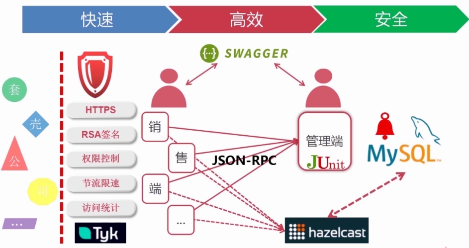
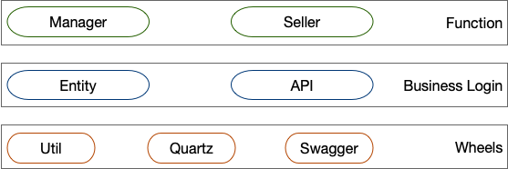
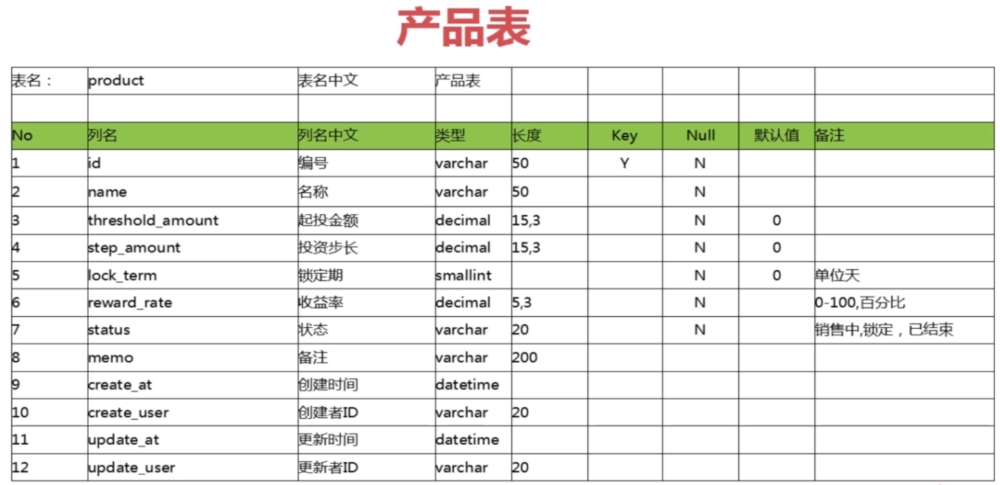
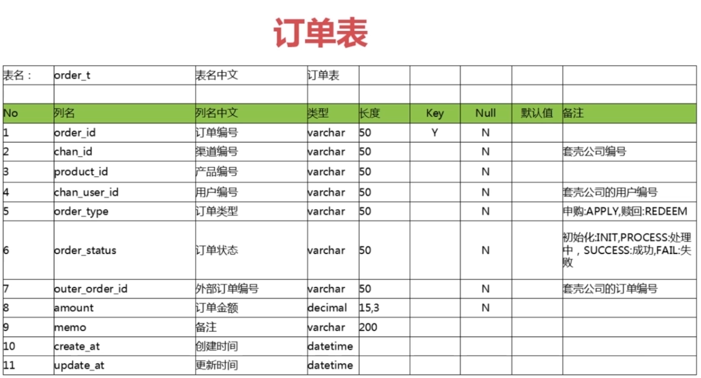

# Financial product system
Financial Products trading platform, backend data transformation and interactivity iwth outer products provider.
## Feature
1. Agile: development, iteration
+ Sale & Management
+ JUnit to test function
+ Swagger to write docs
+ Spring Boot
+ Spring Data JPA: multi data sources and read/write splitting
+ Automation test
2. Effective: high concurrency, fast response
+ Multi-node sale side: JSON-RPC
+ hazelcast cache
+ ActiveMQ
3. Security: Encryption, authority 
+ Tyk: HTTPS, RSA signature, access control, control speed, access statistics

Reconciliation 对账业务

## Modules

1. Util: utilities
2. Quartz: timed task
3. Swagger: interface management
4. Entity: entity classes
5. API: interface of management part and sale apart
6. Management: manage products
+ CRUD function implementation
+ Automation test
+ Swagger: Swagger is an open-source software framework backed by a large ecosystem of tools that helps developers design, build, document, and consume RESTful web services.
7. Sale: sell products
+ jsonRPC: service call each other
+ hazelcast: cache
+ activeMQ: maintain cache event to send massages about cache updates and cache expires
Apache ActiveMQ is an open source message broker written in Java together with a full Java Message Servic e client. 
+ Automation test
+ Tyk: Tyk is an open source `API Gateway` that is fast, scalable and modern. Out of the box, Tyk offers an API Management Platform with an API Gateway, API Analytics, Developer Portal and API Management Dashboard. 
+ quartz: timed task
## DB design
### Manager 
Product: 编号，名称，收益率，锁定期，状态，起投金额，投资步长，备注，创建时间，创建者，更新时间，更新者

### Seller
Order(订单)：订单编号，渠道编号，产品编号，用户编号，外部订单编号，类型，状态，金额，备注，创建时间，更新时间

#### INNODB vs MyISAM?
InnoDB 支持事务处理与外键和行级锁，MyISAM不支持
MyISAM manages nontransactional tables. It provides high-speed storage and retrieval, as well as fulltext searching capabilities. Each MyISAM table is stored on disk in three files. The files have names that begin with the table name and have an extension to indicate the file type. An .frm file stores the table format. The data file has an .MYD (MYData) extension. The index file has an .MYI (MYIndex) extension. Each MyISAM table is stored in a separate file, which could be compressed then with myisamchk if needed.

With InnoDB the tables are stored in tablespace and not much further optimization is possible. All data except for TEXT and BLOB can occupy 8,000 bytes at most. No full text indexing is available for InnoDB. The COUNT(*) execute slower than in MyISAM due to tablespace complexity. InnoDB is a transaction-safe (ACID compliant) storage engine for MySQL that has commit, rollback, and crash-recovery capabilities to protect user data.
MyISAM 和InnoDB 讲解
　　InnoDB和MyISAM是许多人在使用MySQL时最常用的两个表类型，这两个表类型各有优劣，视具体应用而定。基本的差别为：MyISAM类型不支持事务处理等高级处理，而InnoDB类型支持。MyISAM类型的表强调的是性能，其执行数度比InnoDB类型更快，但是不提供事务支持，而InnoDB提供事务支持以及外部键等高级数据库功能。

　　以下是一些细节和具体实现的差别：
　　◆1.InnoDB不支持FULLTEXT类型的索引。
　　◆2.InnoDB 中不保存表的具体行数，也就是说，执行select count(*) from table时，InnoDB要扫描一遍整个表来计算有多少行，但是MyISAM只要简单的读出保存好的行数即可。注意的是，当count(*)语句包含 where条件时，两种表的操作是一样的。
　　◆3.对于AUTO_INCREMENT类型的字段，InnoDB中必须包含只有该字段的索引，但是在MyISAM表中，可以和其他字段一起建立联合索引。
　　◆4.DELETE FROM table时，InnoDB不会重新建立表，而是一行一行的删除。
　　◆5.LOAD TABLE FROM MASTER操作对InnoDB是不起作用的，解决方法是首先把InnoDB表改成MyISAM表，导入数据后再改成InnoDB表，但是对于使用的额外的InnoDB特性(例如外键)的表不适用。
　　另外，InnoDB表的行锁也不是绝对的，假如在执行一个SQL语句时MySQL不能确定要扫描的范围，InnoDB表同样会锁全表，例如update table set num=1 where name like “%aaa%”
　　两种类型最主要的差别就是Innodb 支持事务处理与外键和行级锁。而MyISAM不支持.所以MyISAM往往就容易被人认为只适合在小项目中使用。
　　作为使用MySQL的用户角度出发，Innodb和MyISAM都是比较喜欢的，如果数据库平台要达到需求：99.9%的稳定性，方便的扩展性和高可用性来说的话，MyISAM绝对是首选。
　　原因如下：
　　1、平台上承载的大部分项目是读多写少的项目，而MyISAM的读性能是比Innodb强不少的。
　　2、MyISAM的索引和数据是分开的，并且索引是有压缩的，内存使用率就对应提高了不少。能加载更多索引，而Innodb是索引和数据是紧密捆绑的，没有使用压缩从而会造成Innodb比MyISAM体积庞大不小。
　　3、经常隔1，2个月就会发生应用开发人员不小心update一个表where写的范围不对，导致这个表没法正常用了，这个时候MyISAM的优越性就体现出来了，随便从当天拷贝的压缩包取出对应表的文件，随便放到一个数据库目录下，然后dump成sql再导回到主库，并把对应的binlog补上。如果是Innodb，恐怕不可能有这么快速度，别和我说让Innodb定期用导出xxx.sql机制备份，因为最小的一个数据库实例的数据量基本都是几十G大小。
　　4、从接触的应用逻辑来说，select count(*) 和order by 是最频繁的，大概能占了整个sql总语句的60%以上的操作，而这种操作Innodb其实也是会锁表的，很多人以为Innodb是行级锁，那个只是where对它主键是有效，非主键的都会锁全表的。
　　5、还有就是经常有很多应用部门需要我给他们定期某些表的数据，MyISAM的话很方便，只要发给他们对应那表的frm.MYD,MYI的文件，让他们自己在对应版本的数据库启动就行，而Innodb就需要导出xxx.sql了，因为光给别人文件，受字典数据文件的影响，对方是无法使用的。
　　6、如果和MyISAM比insert写操作的话，Innodb还达不到MyISAM的写性能，如果是针对基于索引的update操作，虽然MyISAM可能会逊色Innodb,但是那么高并发的写，从库能否追的上也是一个问题，还不如通过多实例分库分表架构来解决。
　　7、如果是用MyISAM的话，merge引擎可以大大加快应用部门的开发速度，他们只要对这个merge表做一些select count(*)操作，非常适合大项目总量约几亿的rows某一类型(如日志，调查统计)的业务表。
　　当然Innodb也不是绝对不用，用事务的项目就用Innodb的。另外，可能有人会说你MyISAM无法抗太多写操作，但是可以通过架构来弥补。

## Restful API Design
1. Create product
POST /products JpaRepository
controller中是info级别的日志，实际生产过程中打印info级别，不打印debug级别的
service中是debug级别的日志，实际生产过程中打印info级别，不打印debug级别的
LockTerm锁定期时间，不能设置为int类型，int的默认值是0，不符合requirement 要求，Integer的默认值是null
2. Query single product
GET /products/{id} JpaRepository
3. Query products by condition
GET /products JpaSpecificationExecutor

## Error Handling
+ User friendly error explaination
+ Unified handling, simplified bussiness login code
+ Error standardization
### How the error handling happens
1. First approach
In `spring-boot-autoconfigure` package, in the controller `BasicErrorController`, in `ErrorMvcAutoConfiguration` config class, user-defined error handling is registered.
2. Second Approch
ControllerAdvice is an enhancement of Controller. 
ControllerAdvice is not only for enhancement of Controller.
If Controller has error, then we will go to controllerAdvice. If controllerAdvice has error, then we will go to our self-defined MyErrorController.  
## Time formatation
```
spring:
    jackson:
     date-format: yyyy-MM-dd HH:mm:ss
     time-zone: GMT+8
```
## 测试
1. Unit test: Junit
```
@BeforClass: 在需要测试的class之前执行，只会执行一次
@Before：执行每个测试用例之前，需要执行的method, we can add variables needs to be initialzed in there 
@Test：测试的, Assert, throws exception when error happens
@After：执行每个测试用例之后，需要执行的method, we ca add variables needs to be excuated after testing
@AfterClass:在需要测试的class之后执行，只会执行一次

@RunWith: 提供runner，可以用于spring的测试
```
2. Automated test
在Intellij右边的Gradle tab中，点击Tasks —>build ->(双击)build，就可以运行所有tests，如果通过，那么是可以成功打包为JAR或者WAR的
- test coverage, edge case
- execution sequence annotation: `@FixMethodOrder(MethodSorters.NAME_ASCENDING)` 按测试方法名字典序执行
- Conditional query test case

## Swagger: API Documentation
Swagger is a the world's largest framework of API developer tools for the OpenAPI Specification(OAS). Swagger enables development across the entire API lifecycle, from design and documentation, to test and deployment. 
`http://localhost:8081/manager/swagger-ui.html`
### seperate frontend and backend
Backend developer writes APIs for frontend developers to call. That needs documentation. 
### Third party corperation
Let others know how those API are used.
### Config optimize
- Selectively show interface
- Detailed comment instruction
- i18n change languages
In swagger pakage, in resources folder, we can newly create a swagger-ui.html file to add script of:
`the webjars/springfox-swagger-ui/lang/translator.js`, 
`the webjars/springfox-swagger-ui/lang/zh-cn.js`
### Combination annotation: Another way of config swagger
把多个注解组合在一起，放在一个java文件中，然后在另一个文件中使用该java文件的注解导入这几个组合注解。
Import `SwaggerConfiguration.class` into `EnableMySwagger` interface.
Then add `@EnableMySwagger` to import my swagger configuration into Main function `ManagerApp.java`.
